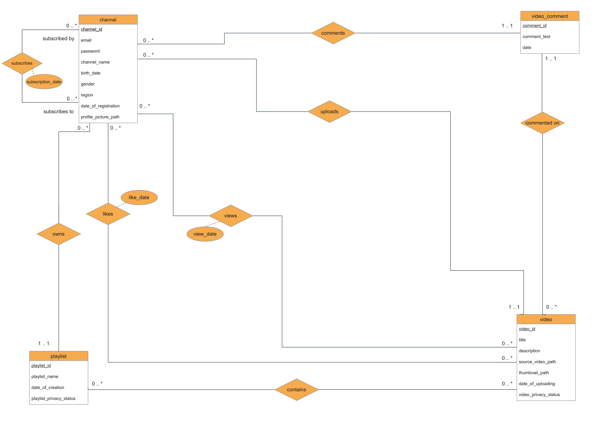
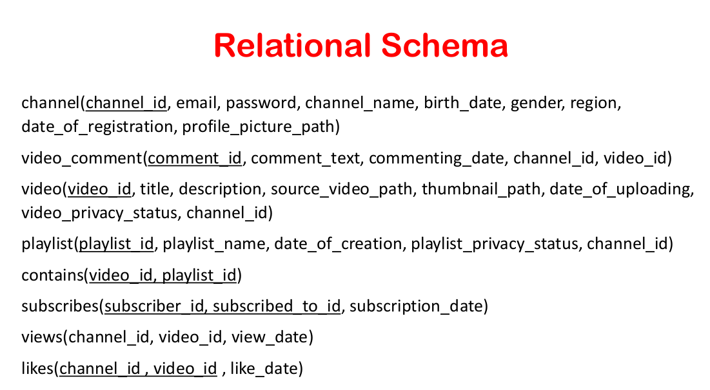

# GG-Tube
<h2>A Simple Database Design and Implementation using Oracle DBMS for a Video Platform Called GG Tube as a Project for Database Systems Course<h2>
<h3>E-R Diagram<h3>

<h3>Relarional Schema</h3>

<h3>Normalization</h3>

1NF, 2NF, and 3NF are Satisfied on all relations.

<h3>Implementation</h3>
<a href="./DDL.sql">Click Here!</a>
  
